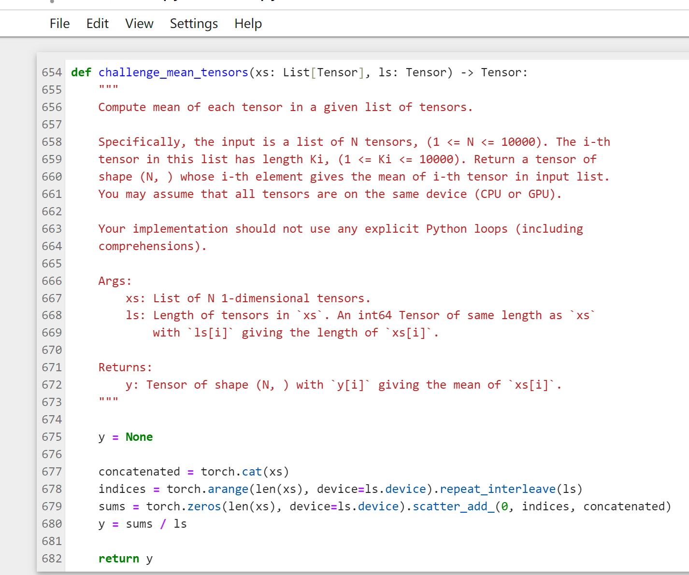
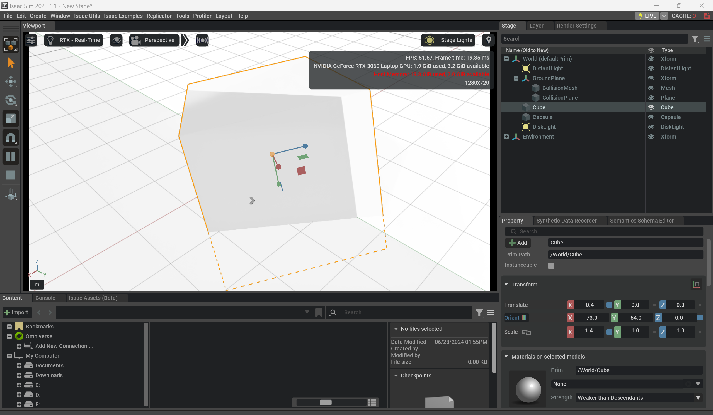
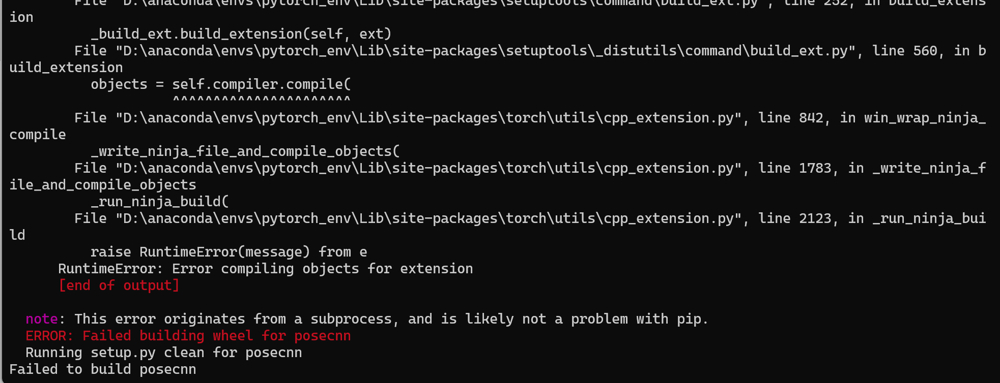

# Week2
## Progress
- Learn basic concepts of CNN
- Learn basic PyTorch usage
	- Finish the Pytorch Tutorial of UMich EECS 498

- Install and run IssacSim

- Try to replicate PoseCNN
	- Successfully Install Eigen, Sophus and python packages
	- Failed at building wheels

## Problems
1. Could not build wheels for PoseCnn

2. Some dataset of PoseCNN are unavailable
3. Do we need to learn the usage of IssacSim

